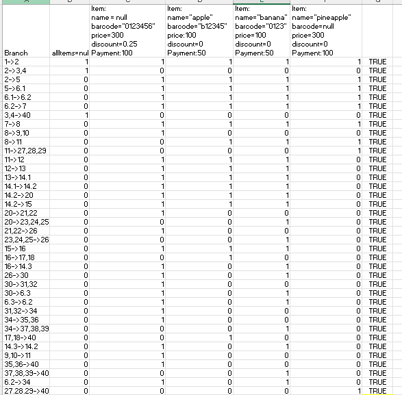

# SI_2024_lab2_226005

Сања Василова 226005

# Control Flow Graph

Секоја линија од кодот е означена со реден број

# Цикломатска комплексност

Цикломатската комплексност ја пресметав како бројот на услови и циклуси + 1 и истата изнесува 10

# Тест случаи според Every Branch

Првиот тест е да се провери дали allItems=null и да фрли исклучок,

Вториот тест е за условот кога name=null, за условот попустот да е поголем од 0, условот сумата да е помала или еднаква на плаќањето, како и условот цената да е поголема од 300, попустот да е поголем од 0 и баркодот да започнува со 0

Третиот тест е за условот кога баркодот има невалиден карактер и фрла исклучок

Четвртиот тест е кога сумата е помала од плаќањето и кога попустот е еднаков на 0

Петиот тест е кога баркодот е null, па ќе фрли исклучок

# Тест случаи според Multiple Condition

if (item.getPrice() > 300 && item.getDiscount() > 0 && item.getBarcode().charAt(0)
== '0')

FXX, item.getPrice() <= 300, бидејќи имаме логичко И (&&) не е потребно да ги гледаме останатите проверки, вредноста на целиот исказ е false

TFX, item.getPrice() < 300, а item.getDiscount <= 0, нема потреба од проверка на третиот услов, вредноста на целиот исказ е false

TTF, item.getPrice() < 300, item.getDiscount > 0, а item.getBarcode().charAt(0) != '0', вредноста на целиот исказ е false

TTT, item.getPrice() < 300, item.getDiscount > 0, item.getBarcode().charAt(0) == '0', вредноста на целиот исказ е true